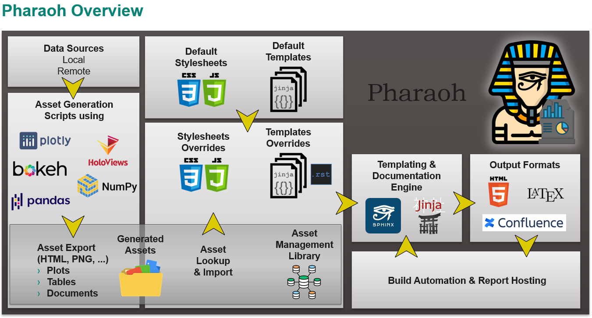

=======
Pharaoh
=======

Pharaoh is a |Sphinx|-based Python framework for
generating reports in various format (HTML, Confluence, PDF) by combining the power of configurable
|Jinja| templates and Python scripts for asset (tables, plots, pictures, etc...) generation.

=================
Table of Contents
=================

.. toctree::
   :maxdepth: 3

   intro
   installation
   user_guide
   template_designer_guide
   reference/index
   plugins/index
   examples/index
   contact
   changelog
   dev

Indices and tables
==================

* :ref:`genindex`
* :ref:`modindex`
* :ref:`search`
